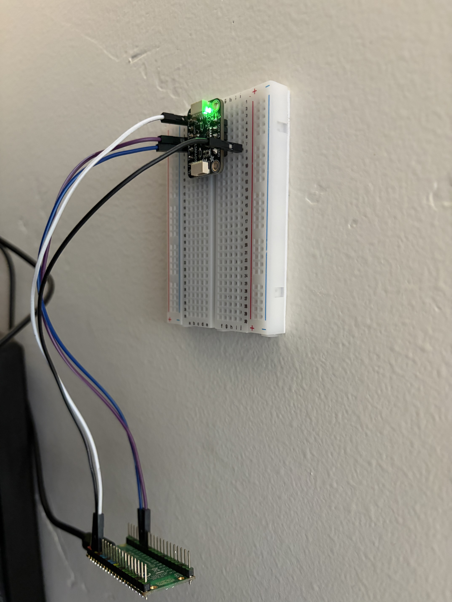
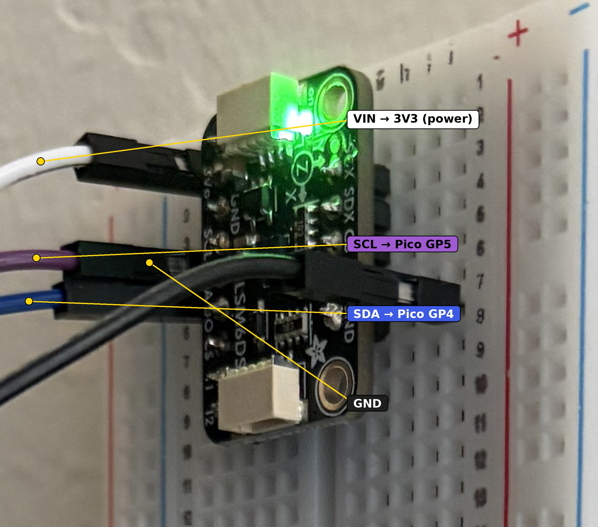

# LiveQuakes Pico Seismometer

A DIY earthquake-detecting seismometer built from a Raspberry Pi Pico 2 W and
an ST LSM6DSOX accelerometer, running MicroPython. It reports real shake
events to [LiveQuakes](https://livequakes.com)'s community stations network,
so this station's detections show up on the live public map right alongside
official USGS data.

Total hardware cost is well under $30 -- built as a cheap, hackable
alternative to a Raspberry Shake for anyone who wants to contribute real
sensor data.

*The finished sensor, mounted and reporting live. The green LED means it's powered and running.*

## How it works

The firmware polls the accelerometer as fast as I2C allows and runs a
classic seismology-style **STA/LTA** (short-term-average / long-term-average)
trigger -- the same class of algorithm real seismometer software (e.g.
ObsPy's `recursive_sta_lta`) uses. A short exponential moving average tracks
"what's happening right now," a long one tracks "the ambient noise floor,"
and a trigger fires when the ratio between them spikes. That adapts to
wherever you mount it, instead of using one fixed threshold that's too
twitchy in a noisy spot or too dead in a quiet one.

It uses the full 3-axis acceleration vector's *magnitude*, not a single
axis, so the sensor doesn't need to be mounted perfectly level or in any
particular orientation -- at rest, `|x, y, z|` is always ~1g regardless of
which way is "up" for the board.

When a trigger starts and ends, the firmware POSTs the event's peak
amplitude and duration to LiveQuakes' ingestion API, with automatic retries
in case the very first HTTPS/TLS handshake after boot flakes out (a known
quirk on constrained MicroPython WiFi stacks).

## Hardware

- Raspberry Pi Pico 2 W
- [Adafruit LSM6DSOX breakout](https://www.adafruit.com/product/4438) (accelerometer + gyro; only the accelerometer is used here)
- 4 wires (I2C: SDA, SCL, plus power and ground)

## Wiring

| LSM6DSOX | Pico 2 W    |
|----------|-------------|
| VIN      | 3V3 (OUT)   |
| GND      | GND         |
| SCL      | GP5         |
| SDA      | GP4         |

## Setup

1. Flash MicroPython onto the Pico 2 W if you haven't already.
2. In Thonny (or your MicroPython IDE of choice), install the `urequests`
   library: `import mip; mip.install("urequests")`.
3. Copy `config.py.example` to `config.py` and fill in your WiFi credentials.
4. Go to the **Community Stations** section on
   [livequakes.com](https://livequakes.com), sign in, and register a new
   station to get an API key. Paste it into `config.py` as
   `STATION_API_KEY`.
5. Upload `lsm6dsox.py`, `main.py`, and your filled-in `config.py` to the
   Pico's root, then power-cycle it (or run `main.py` from the IDE).
6. Watch the Shell/REPL output: it connects to WiFi, finds the sensor over
   I2C, warms up for 90 seconds, and then starts watching for triggers.
   When one fires, you'll see it reported, and your station will show up on
   the LiveQuakes map.

`config.py` is gitignored on purpose -- it holds your WiFi password and your
station's private API key. Never commit it.

While you're getting the wiring and tuning right, you'll likely rack up a
pile of test triggers. Sign in on livequakes.com, click your station (in
**My stations**), and you can delete individual events or use **Clear all
events** to wipe the test data in one go without losing the station or its
API key.

## Tuning

The tunables at the top of `main.py` (trigger sensitivity, warmup time,
amplitude scaling, etc.) are commented inline. Set `DEBUG_STATUS = True`
(on by default) and watch the Shell/REPL output: it prints the live
STA/LTA ratio every few seconds so you can see where your ambient noise
floor actually sits before deciding how far to lower `TRIGGER_RATIO`.

At power-up, `main.py` takes a 1-second calibration burst to measure your
board's actual resting acceleration (printed as `Baseline calibrated:
X.XXXXXg`) rather than assuming exactly 1.000g -- keep the board still
during that one second. On the reference board this project was built on,
idle `ratio` settled to roughly 1.0-1.5 once warmed up. `3.0` reliably
caught real small shakes but also fired from just tapping the table it
was sitting on, so `TRIGGER_RATIO` defaults to `4.0` -- comfortable
headroom above idle noise while still catching a genuine small tremor.
Your own board's idle ratio will differ, so watch `DEBUG_STATUS` at rest
for a minute before trusting any threshold -- `1.0` is the ratio's
mathematical equilibrium point (STA and LTA drift above/below it from
plain noise with zero real shaking), so the closer you get to it, the
more false events you'll get, not just real tremors. If your mount is
picking up too much local noise, a more rigid mount (bolted/clamped
rather than sitting loose on a desk) helps more than retuning thresholds.

**Testing gotcha:** `WARMUP_S` (default 90s) only blocks *triggering* --
`lta` (the ambient-noise average) keeps updating the whole time, warmup
included. Shaking the board to "test" it during warmup gets absorbed as
normal background noise and raises your effective threshold for a while
after warmup ends too. Power-cycle, leave it completely still for the
full warmup, *then* do a test shake.

### Telling a tremor from a door slam / footstep / tap

Amplitude alone can't do this -- a sharp knock can produce just as high a
peak-g reading as a gentle real shake (confirmed the hard way: tapping the
table this project sits on triggered it at first). The actual physical
difference is duration and shape: a knock is one brief impulse the board's
structure absorbs and stops ringing from almost immediately, while real
ground shaking keeps the raw signal meaningfully elevated for a sustained
stretch. `main.py` checks this directly on the raw (pre-smoothing) signal:
an event only gets reported if the raw deviation stays above
`RAW_ELEVATED_MULT` times the noise floor for at least `SUSTAINED_MS`
somewhere during the event; otherwise it prints `IMPULSIVE, not reporting`
and drops it. Tune `SUSTAINED_MS` down if real small tremors start getting
rejected, or up if taps/door slams still slip through.

This is a cheap heuristic, not true seismic phase discrimination -- real
seismic networks lean on frequency-domain analysis and, more importantly,
*network coincidence* (an event only counts if multiple nearby stations
see it within a plausible travel-time window), which is a server-side
problem, not a firmware one. A single DIY sensor doing its best on-device
is inherently going to have false positives sometimes; a solid mount away
from doors and high-traffic areas will do more for accuracy than any
threshold tweak.

## License

MIT -- see [LICENSE](LICENSE).
